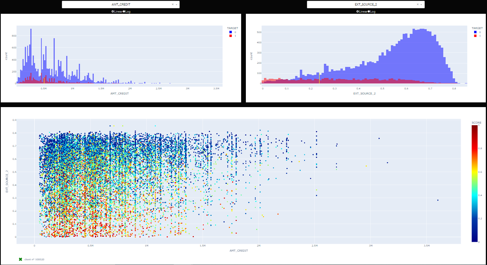

<h1 align="center">Dashboard</h1>

<b>L'application est hébergée sur Heroku. Pour des raisons financières, le serveur est désactivé en dehors des phases de test.</b>

# :bar_chart: C'est quoi Dashboard?

Il s'agit du dashboard interactif mis à la disposition des chargés de relation client de Home Credit Default Risk pour expliquer de la façon la plus transparente possible les décisions d'octroi de crédit mais également permettre à leurs clients de disposer de leurs informations personnelles et de les explorer facilement.

Le dashboard est découpé en 3 zones :

## 1. Bloc 1
Après avoir sélectionné l'ID du client, 3 graphes s'affichent:
- Le score du client, correspondant à sa probabilité à faire défaut. Ce score est retourné par l'API
- Les variables qui expliquent le score du client sélectionné
- Les variables qui influence le plus en moyenne le score de tous les clients de Home Credit Default Risk

## 2. Bloc 2
Après avoir sélectionné 2 variables continues dans les listes déroulantes, 3 graphes s'affichent : 
- L'histogramme de la 1ère variable
- L'histogramme de la 2ème variable
- Un graphique d'analyse bivariée entre les 2 variables

## 3. Bloc 3
Après avoir sélectionné 1 variables qualitative, 3 graphes s'affichent :
- Le boxplot de la variable
    - En bleu, la catégorie à laquelle appartient le client
    - En noir, les autres catégories
- Le pieplot représentant la distribution de la variable parmi tous les clients de Home Credit Default Risk
- La proportion de clients ayant fait défaut pour chacune des modalités de la variable

# Découpage des dossiers

- **main.py** : fichier principal contenant le code de l'application
- **requirements.txt** : contient toutes les dépendances à installer pour faire marcher l'application
- **runtime.txt** : signale à Heroku avec quel langage exécuter l'application
- **Procfile** : contient la ligne de commande que Heroku doit exécuter pour que l'application se mette en marche
- **mode.pkl** : modèle avec lequel la prédiction du score est réalisée
- **test.py** :  tests unitaires de l'application
- **shap_plots.py** : contient le code pour tracer les graphes de feature d'importance locale et globale
- **data/** : fichier de clients
- **images/** : Images de l'application

